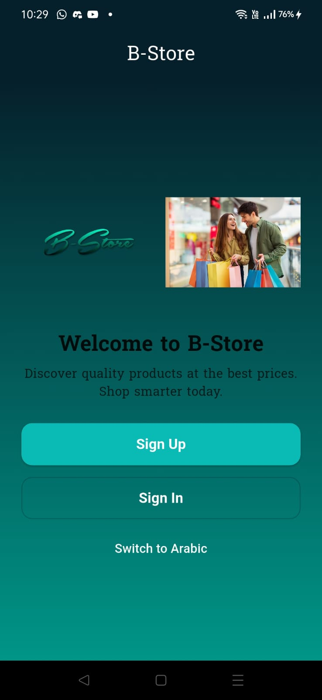
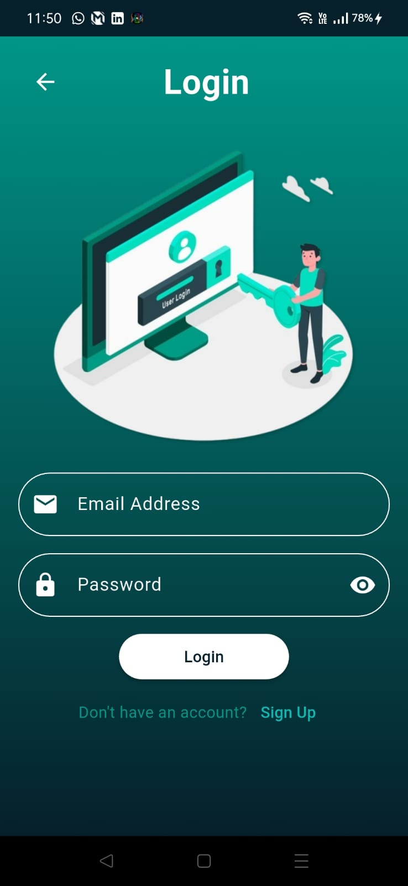
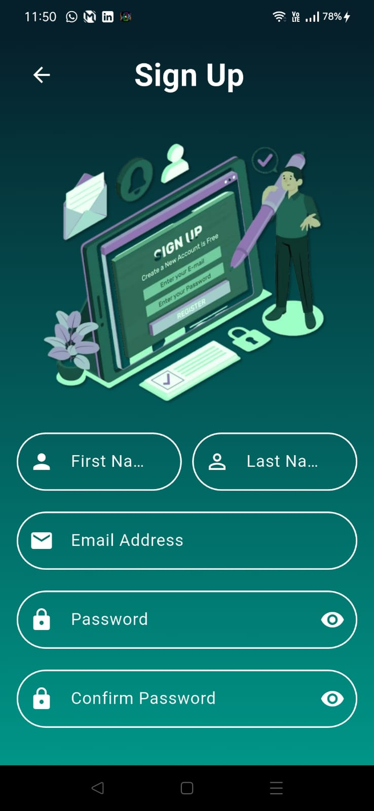
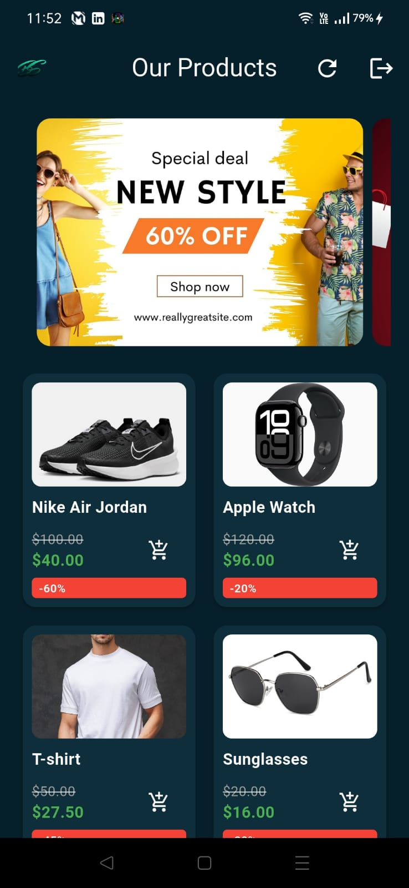
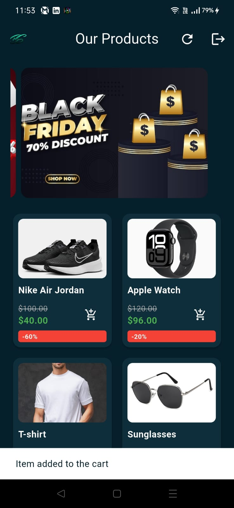
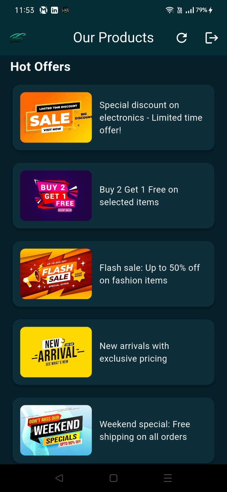
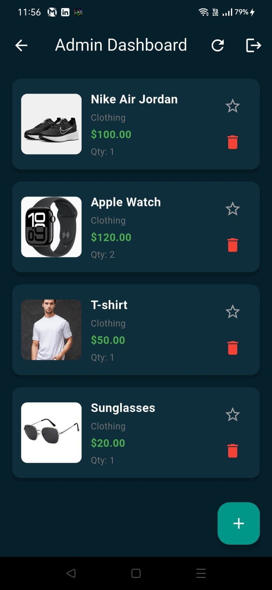
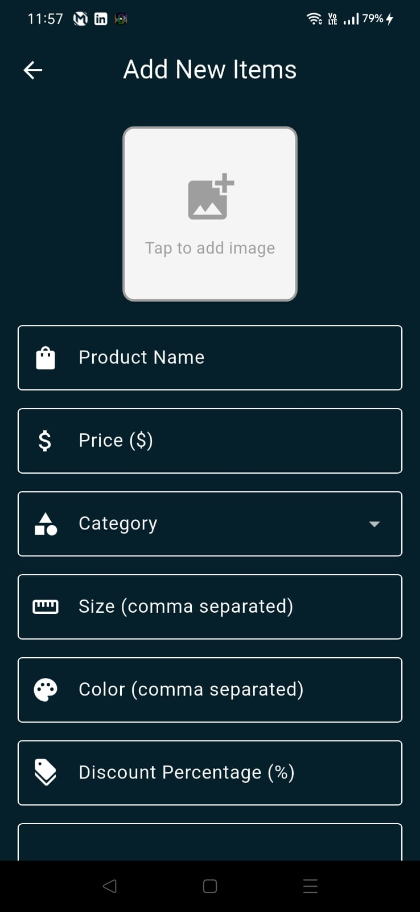
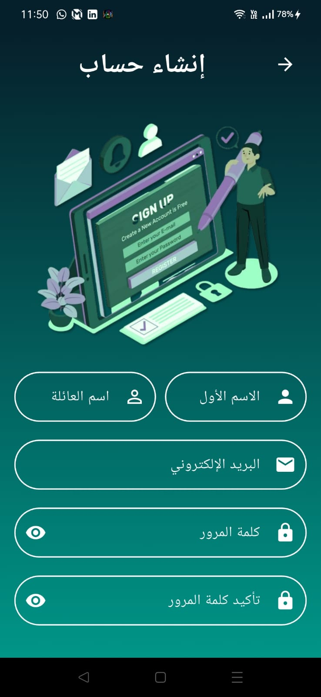
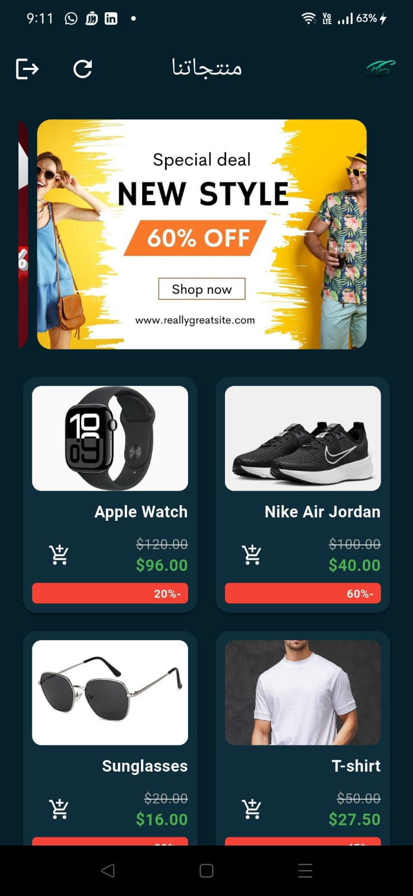

# B-Store 🛍️

A modern Flutter e-commerce application with role-based authentication, featuring both admin and user interfaces. Built with Firebase backend services and supporting multilingual functionality (English/Arabic).

## 📱 Project Overview

B-Store is a comprehensive e-commerce mobile application that provides a seamless shopping experience for users while offering powerful administrative tools for store management. The app features a beautiful, modern UI with smooth animations and supports both light and dark themes.

### Key Highlights
- **Role-Based Access Control**: Separate interfaces for Admin and User roles
- **Firebase Integration**: Complete backend with Authentication, Firestore, and Storage
- **Multilingual Support**: English and Arabic language support
- **Modern UI/UX**: Beautiful gradients, animations, and responsive design
- **Product Management**: Full CRUD operations for product management
- **Image Handling**: Base64 image storage and display
- **Real-time Updates**: Live product updates and inventory management

## ✨ Features

### 🔐 Authentication & User Management
- **Secure Authentication**: Firebase Authentication with email/password
- **Role-Based Login**: Admin and User role selection during signup
- **User Profiles**: Complete user information management
- **Session Management**: Persistent login sessions with SharedPreferences

### 👤 User Features
- **Product Catalog**: Browse all available products in a beautiful grid layout
- **Product Details**: View product information, pricing, and images
- **Shopping Cart**: Add items to cart functionality
- **Hot Offers**: Featured promotional banners and offers
- **Responsive Design**: Optimized for different screen sizes
- **Language Switching**: Toggle between English and Arabic

### 👨‍💼 Admin Features
- **Product Management**: Add, edit, delete products
- **Image Upload**: Select and upload product images from gallery
- **Inventory Control**: Manage product quantities and availability
- **Featured Products**: Mark products as featured for promotion
- **Category Management**: Organize products by categories
- **Real-time Dashboard**: Live view of all products and statistics

### 🌐 Technical Features
- **Firebase Backend**: Cloud Firestore for data storage
- **Image Storage**: Base64 encoding for product images
- **Localization**: Complete i18n support with easy_localization
- **Custom Fonts**: Suwannaphum font family integration
- **Animations**: Smooth page transitions and UI animations
- **Error Handling**: Comprehensive error handling and user feedback

## 🚀 Setup Instructions

### Prerequisites
- Flutter SDK (>=3.4.4)
- Dart SDK
- Android Studio / VS Code
- Firebase account
- Git

### Installation Steps

1. **Clone the Repository**
   ```bash
   git clone https://github.com/yourusername/b_store.git
   cd b_store
   ```

2. **Install Dependencies**
   ```bash
   flutter pub get
   ```

3. **Firebase Setup**
   
   **For Android:**
   - Go to [Firebase Console](https://console.firebase.google.com/)
   - Create a new project or use existing project `b-store-ed2ba`
   - Download `google-services.json` and place it in `android/app/`
   - Enable Authentication, Firestore Database, and Storage in Firebase Console

   **For iOS:**
   - Download `GoogleService-Info.plist` from Firebase Console
   - Place it in `ios/Runner/`
   - Update `ios/Runner/Info.plist` with Firebase configuration

4. **Configure Firebase Rules**
   
   **Firestore Rules:**
   ```javascript
   rules_version = '2';
   service cloud.firestore {
     match /databases/{database}/documents {
       match /users/{userId} {
         allow read, write: if request.auth != null && request.auth.uid == userId;
       }
       match /products/{productId} {
         allow read: if request.auth != null;
         allow write: if request.auth != null && 
           get(/databases/$(database)/documents/users/$(request.auth.uid)).data.role == 'Admin';
       }
     }
   }
   ```

5. **Run the Application**
   ```bash
   flutter run
   ```

### Environment Configuration

The app uses the following Firebase project configuration:
- **Project ID**: `b-store-ed2ba`
- **Android App ID**: `1:968824466021:android:51eeb347cd7649f16bb48c`
- **iOS App ID**: `1:968824466021:ios:a36ce2e9a338898c6bb48c`

## 📱 Screenshots

### Welcome & Authentication Screens
| Welcome Screen | Login Screen | Signup Screen |
|---|---|---|
|  |  |  |

### User Interface
| User Home Screen | Product Grid | Hot Offers |
|---|---|---|
|  |  |  |

### Admin Interface
| Admin Dashboard | Add Items Screen |
|---|---|
|  |  |

### Arabic Language Support
| Arabic Login | Arabic Signup | Arabic User Home |
|---|---|---|
|  |  |  |

## 🏗️ Project Structure

```
lib/
├── Colors/
│   └── app_colors.dart          # App color definitions
├── Services/
│   ├── auth_service.dart        # Authentication service
│   └── product_service.dart      # Product management service
├── Theme/
│   └── app_theme.dart           # App theme configuration
├── View/
│   ├── Role_based_login/
│   │   ├── Admin/
│   │   │   └── Screen/
│   │   │       ├── admin_home_screen.dart
│   │   │       └── add_items.dart
│   │   ├── User/
│   │   │   └── user_home_screen.dart
│   │   ├── login_screen.dart
│   │   └── signup_screen.dart
│   ├── splash_screen.dart
│   └── welcome_screen.dart
├── firebase_options.dart
└── main.dart
```

## 🛠️ Dependencies

### Core Dependencies
- `flutter`: SDK framework
- `firebase_core`: Firebase core functionality
- `firebase_auth`: User authentication
- `cloud_firestore`: NoSQL database
- `firebase_storage`: File storage

### UI & UX
- `google_fonts`: Custom typography
- `flutter_animate`: Animation library
- `page_transition`: Page transition effects
- `iconsax`: Icon library
- `cached_network_image`: Image caching

### Utilities
- `image_picker`: Image selection from gallery
- `shared_preferences`: Local data storage
- `mask_text_input_formatter`: Input formatting
- `easy_localization`: Internationalization

## 🔧 Configuration

### Firebase Collections Structure
```
users/
├── {userId}/
│   ├── firstName: string
│   ├── lastName: string
│   ├── email: string
│   ├── phone: string
│   ├── address: string
│   ├── role: string (Admin/User)
│   ├── createdAt: timestamp
│   └── profileImageUrl: string

products/
├── {productId}/
│   ├── name: string
│   ├── price: number
│   ├── category: string
│   ├── size: string
│   ├── color: string
│   ├── discount: number
│   ├── description: string
│   ├── quantity: number
│   ├── imageData: string (base64)
│   ├── isFeatured: boolean
│   ├── createdAt: timestamp
│   └── updatedAt: timestamp
```

## 🌍 Localization

The app supports two languages:
- **English** (`en.json`)
- **Arabic** (`ar.json`)

Language files are located in `assets/translations/` and include all UI text, error messages, and user feedback.

## 🎨 Customization

### Colors
The app uses a custom color scheme defined in `lib/Colors/app_colors.dart`:
- Primary: Teal gradient
- Secondary: Dark blue (`#06202B`)
- Accent: White and gray tones

### Fonts
Custom Suwannaphum font family with multiple weights:
- Thin (100)
- Light (300)
- Regular (400)
- Bold (700)
- Black (900)

## 🚀 Deployment

### Android
```bash
flutter build apk --release
flutter build appbundle --release
```

### iOS
```bash
flutter build ios --release
```

## 🤝 Contributing

1. Fork the repository
2. Create a feature branch (`git checkout -b feature/AmazingFeature`)
3. Commit your changes (`git commit -m 'Add some AmazingFeature'`)
4. Push to the branch (`git push origin feature/AmazingFeature`)
5. Open a Pull Request

## 📄 License

This project is licensed under the MIT License - see the [LICENSE](LICENSE) file for details.


---

**Made with ❤️ using Flutter**